# 1、使用 InternLM2-Chat-1.8B 模型生成 300 字的小故事
## 选择开发机环境
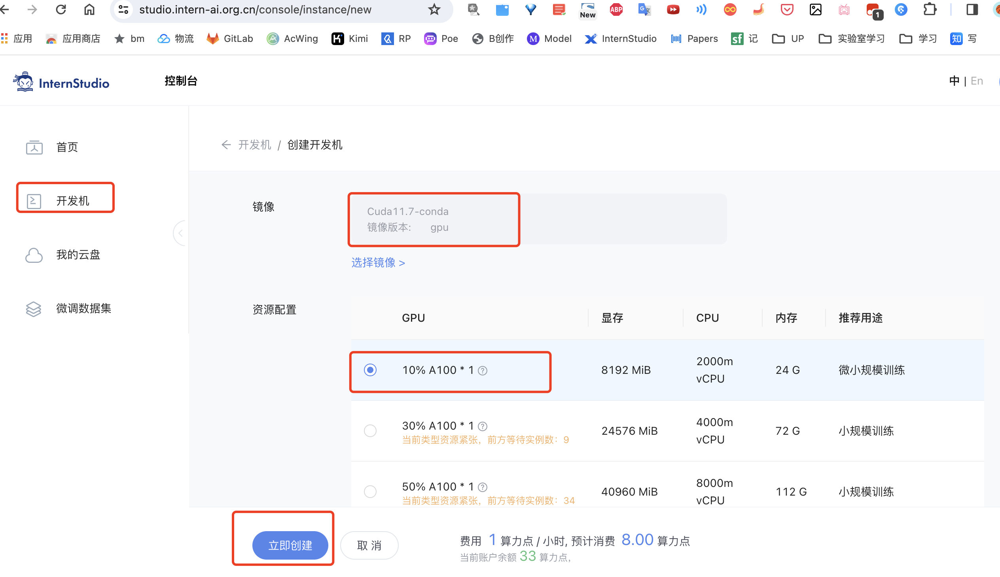
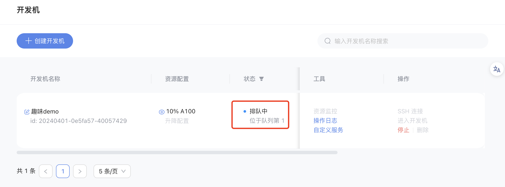
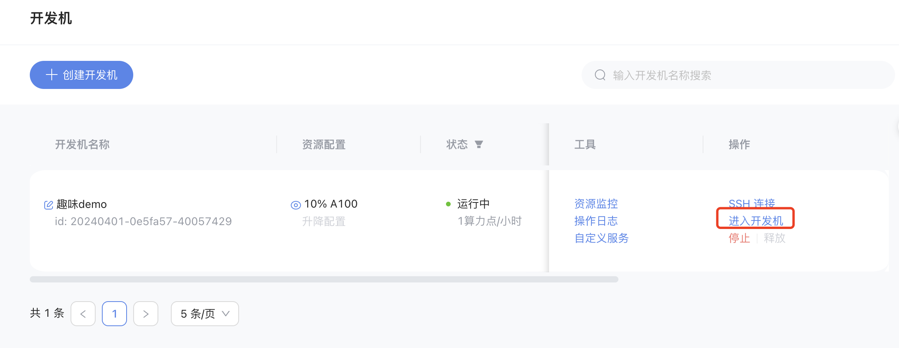

## 安装相关软件包
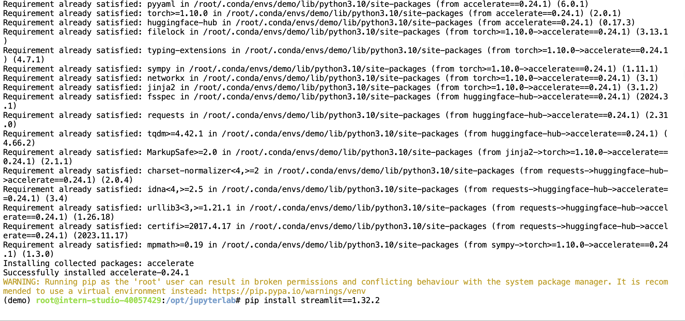
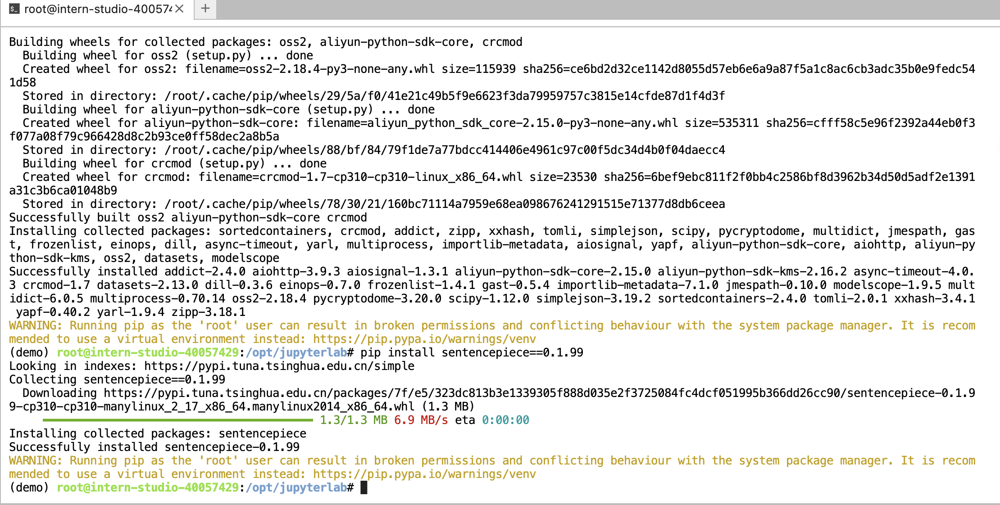

## 下载对应的模型权重
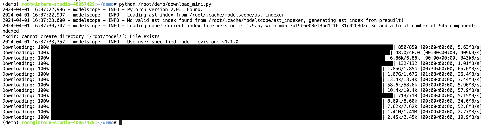

## 启动，测试
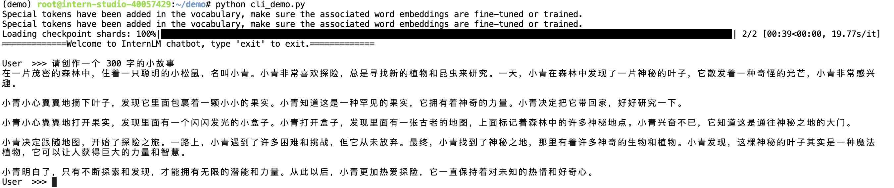

# 2、熟悉 huggingface 下载功能
> 熟悉 huggingface 下载功能，使用 huggingface_hub python 包，下载 InternLM2-Chat-7B 的 config.json 文件到本地（需截图下载过程）

## 对应的huggingface_hub的下载文件方法如下： 


```
# pip install -U huggingface_hub
import os 
from huggingface_hub import hf_hub_download  # Load model directly 

hf_hub_download(repo_id="internlm/internlm2-7b", filename="config.json")
```

## 对应的modelscope.hub的下载文件方法如下： 
```
from modelscope.hub.file_download import model_file_download
model_file_download(model_id="Shanghai_AI_Laboratory/InternLM2-Chat-7B", 
                    file_path="config.json",
                    revision='v1.1.0')
```


# 3、实践部署 浦语·灵笔2 模型

## 3.1、图文创作 
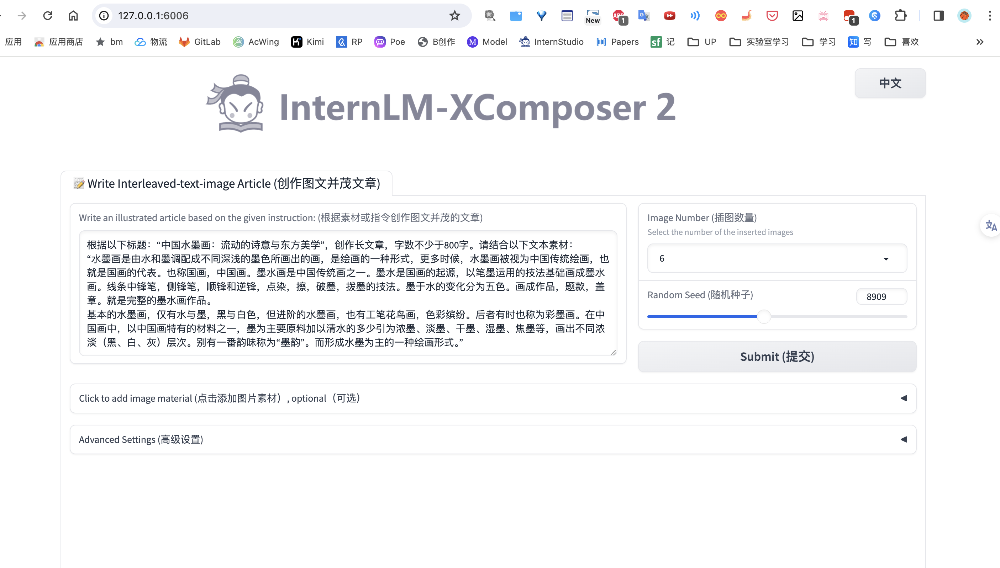
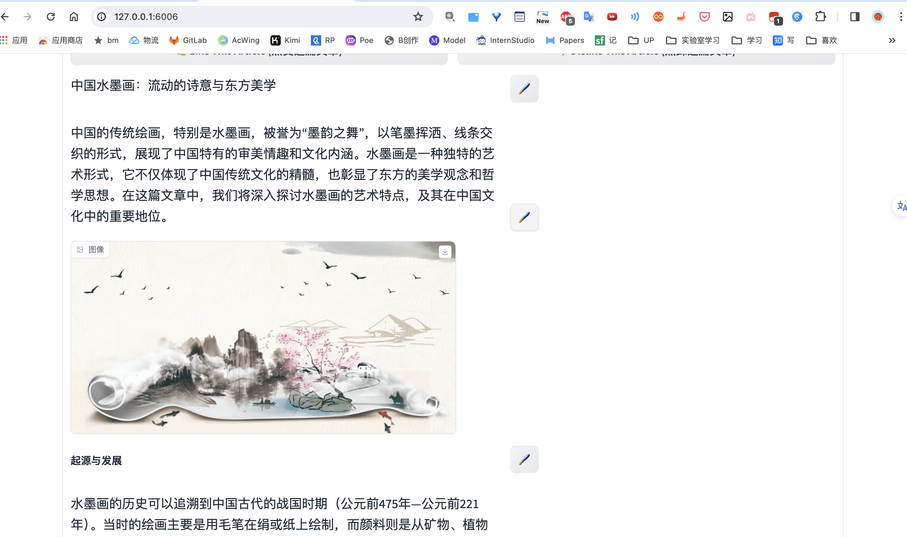

## 3.2、视觉问答
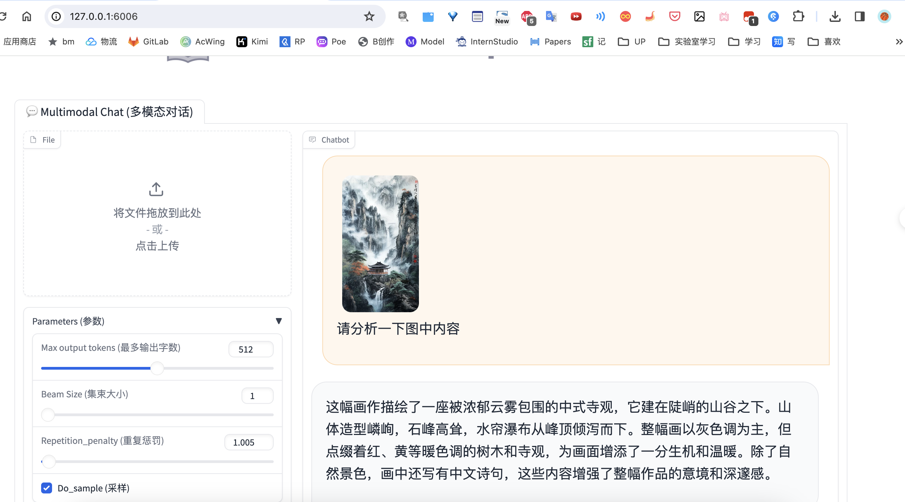


# 4、使用Lagent工具调用数据分析

## 4.1、激活环境，下载代码，切换到对应版本
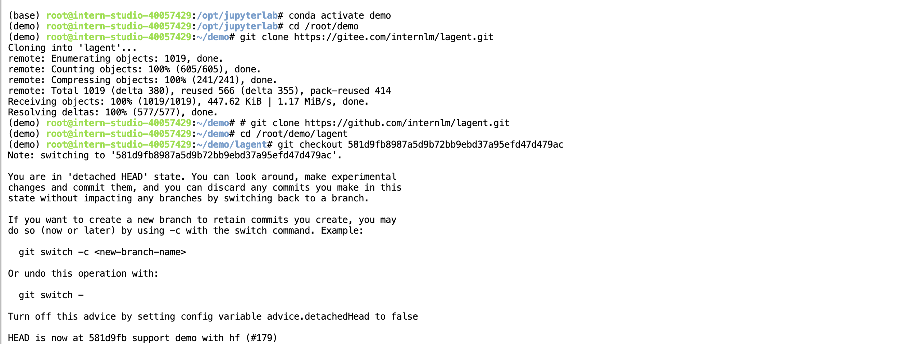
## 4.2、安装源码环境
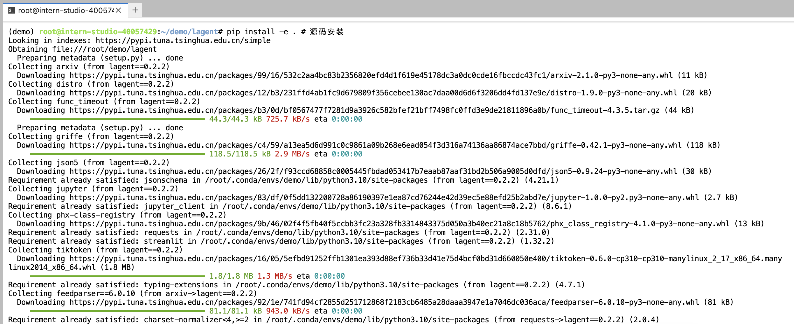
## 4.3、切换模型对应的路径
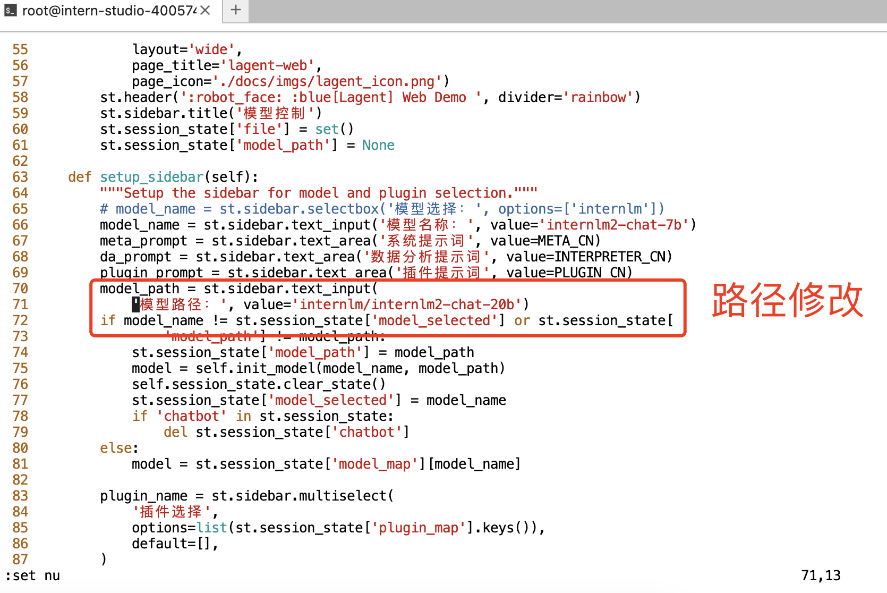
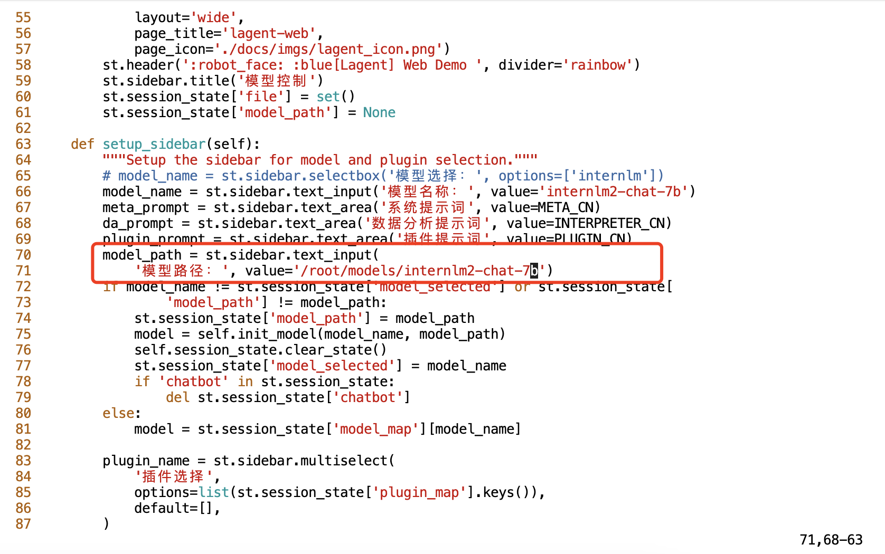
## 4.4、streamlit在线展示
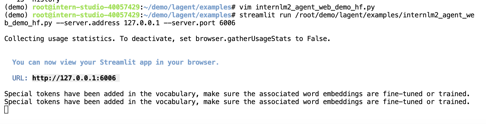
## 4.5、进行端口转发
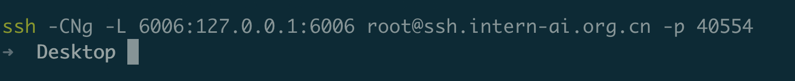
## 4.6、页面提问
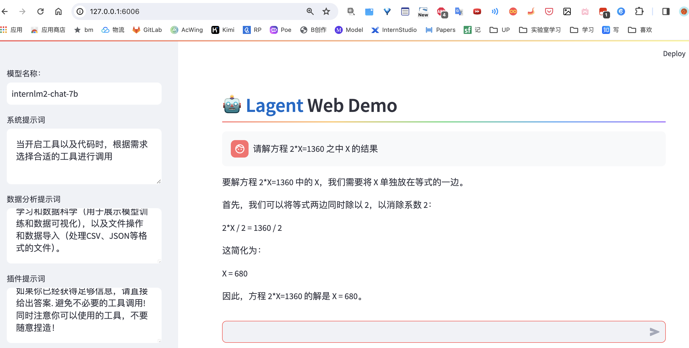
## 4.7、勾选数据分析提问
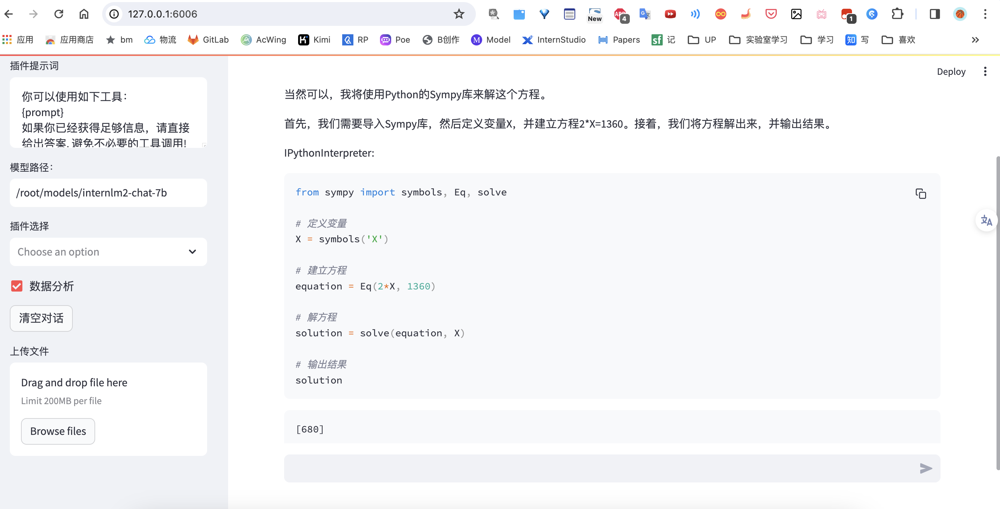