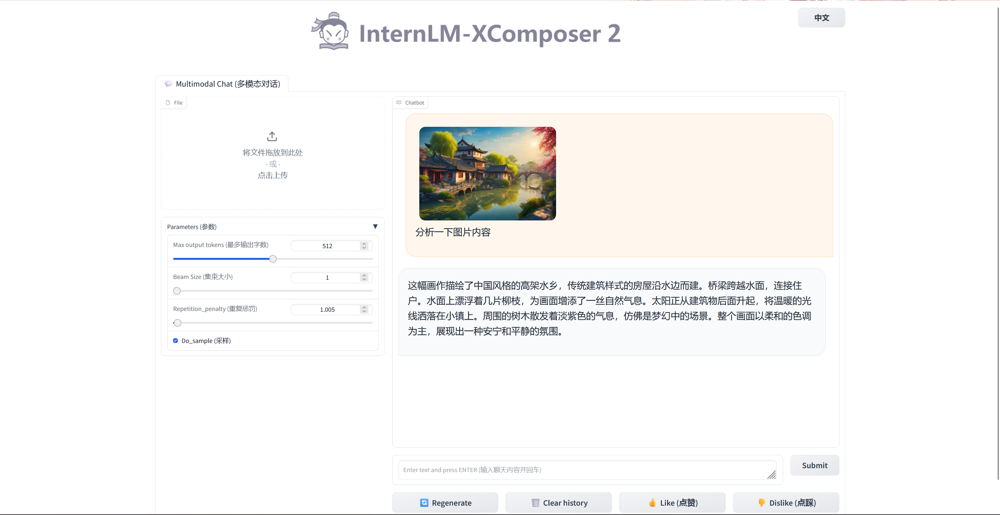

# 实验环境配置步骤

    1、选择创建开发机
    2、勾选镜像Cuda11.7-conda
    3、选择匹配的资源如：10% A100 * 1
    4、进入开发机
    5、创建环境：studio-conda -o internlm-base -t demo
    6、激活环境：conda activate demo
    7、补充确实的安装包

这个好像是studio对应的内部命令，已经配置好了对应的环境
文档中也给了从零开始创建对应的系统的方法： 

```
# 与 studio-conda 等效的配置方案
# conda create -n demo python==3.10 -y
# conda activate demo
# conda install pytorch==2.0.1 torchvision==0.15.2 torchaudio==2.0.2 pytorch-cuda=11.7 -c pytorch -c nvidia
```


# 下载测试InternLM2-Chat-1.8B

1、下载对应的模型

教程中使用的是从modelscope上进行模型的下载，modelscope是对标国外huggingface的模型托管平台，常用的数据集也可以在上面进行下载。

```
from modelscope.hub.snapshot_download import snapshot_download

snapshot_download(model_name,
                  cache_dir=save_dir,
                  revision='v1.1.0')
```

2、加载运行相关的模型

核心步骤是加载对应的tokenizer,model,传入prompt看模型的输出

```
import torch
from transformers import AutoTokenizer, AutoModelForCausalLM

model_name_or_path = "/root/models/Shanghai_AI_Laboratory/internlm2-chat-1_8b"

tokenizer = AutoTokenizer.from_pretrained(model_name_or_path, trust_remote_code=True, device_map='cuda:0')
model = AutoModelForCausalLM.from_pretrained(model_name_or_path, trust_remote_code=True, torch_dtype=torch.bfloat16, device_map='cuda:0')

# 调用的时候要切换成eval模型进行推理

model = model.eval()

system_prompt = """You are an AI assistant whose name is InternLM (书生·浦语).
- InternLM (书生·浦语) is a conversational language model that is developed by Shanghai AI Laboratory (上海人工智能实验室). It is designed to be helpful, honest, and harmless.
- InternLM (书生·浦语) can understand and communicate fluently in the language chosen by the user such as English and 中文.
"""

messages = [(system_prompt, '')]

print("=============Welcome to InternLM chatbot, type 'exit' to exit.=============")

while True:
    input_text = input("\nUser  >>> ")
    input_text = input_text.replace(' ', '')
    if input_text == "exit":
        break

    length = 0
    for response, _ in model.stream_chat(tokenizer, input_text, messages):
        if response is not None:
            print(response[length:], flush=True, end="")
            length = len(response)

```

3、测试效果如下


# 部署实战营优秀作品 八戒-Chat-1.8B 模型

1、步骤与上述流程类似

2、这里采用页面展示进行对话，使用Streamlit

```
streamlit run /root/Tutorial/helloworld/bajie_chat.py --server.address 127.0.0.1 --server.port 6006
```

3、运行之后要做端口转发

因为是远程服务器上的服务，本地需要方位要进行端口转发

```
# 从本地使用 ssh 连接 studio 端口
# 将下方端口号 38374 替换成自己的端口号
ssh -CNg -L 6006:127.0.0.1:6006 root@ssh.intern-ai.org.cn -p 38374
```

4、测试效果如下


# 使用 Lagent 运行 InternLM2-Chat-7B 模型

1、Lagent的相关知识


2、样例演示数据分析的功能

步骤如下： 

    1、加载准备好的模型权重
    2、修改执行代码对应的路径
    3、Streamlit运行对应的代码，加载模型
    4、进行端口转发
    5、在线测试


# 实践部署 浦语·灵笔2 模型

> 这里要申请50% A100的资源才能够跑起来

1、模型介绍

浦语·灵笔2 是基于 书生·浦语2 大语言模型研发的突破性的图文多模态大模型，具有非凡的图文写作和图像理解能力，在多种应用场景表现出色，总结起来其具有：

    自由指令输入的图文写作能力： 
    浦语·灵笔2 可以理解自由形式的图文指令输入，包括大纲、文章细节要求、参考图片等，为用户打造图文并貌的专属文章。生成的文章文采斐然，图文相得益彰，提供沉浸式的阅读体验。
    准确的图文问题解答能力：
    浦语·灵笔2 具有海量图文知识，可以准确的回复各种图文问答难题，在识别、感知、细节描述、视觉推理等能力上表现惊人。
    杰出的综合能力： 
    浦语·灵笔2-7B 基于 书生·浦语2-7B 模型，在13项多模态评测中大幅领先同量级多模态模型，在其中6项评测中超过 GPT-4V 和 Gemini Pro。

2、具体步骤

    1、激活环境
    2、安装包
    3、下载代码仓库
    4、链接本地的模型权重
    5、执行启动 InternLM-XComposer 设定相关参数 （图文写作）
    6、端口转发
    7、在线测试
    - 图片理解实战类似步骤，修改参数命令即可



