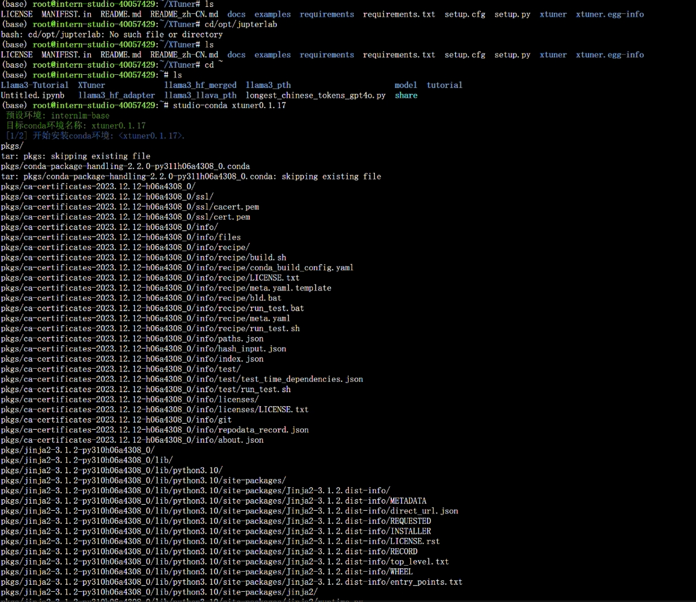
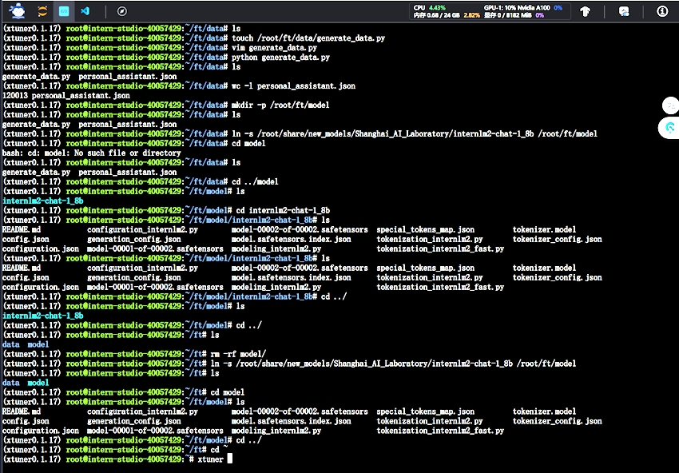
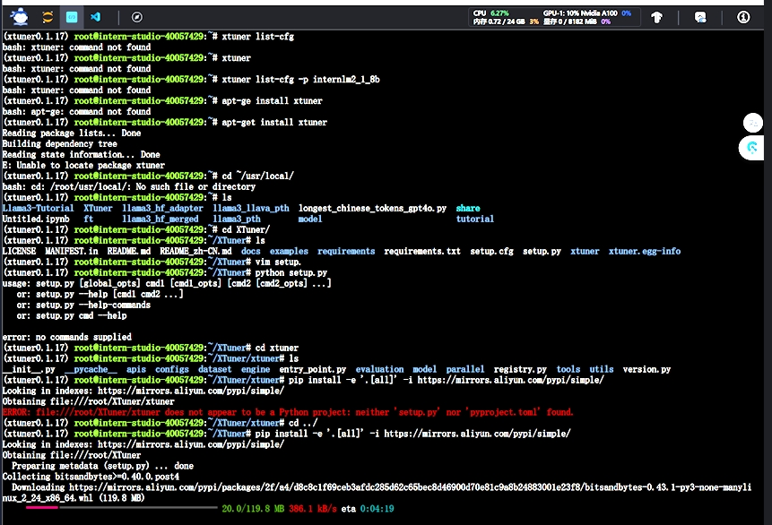
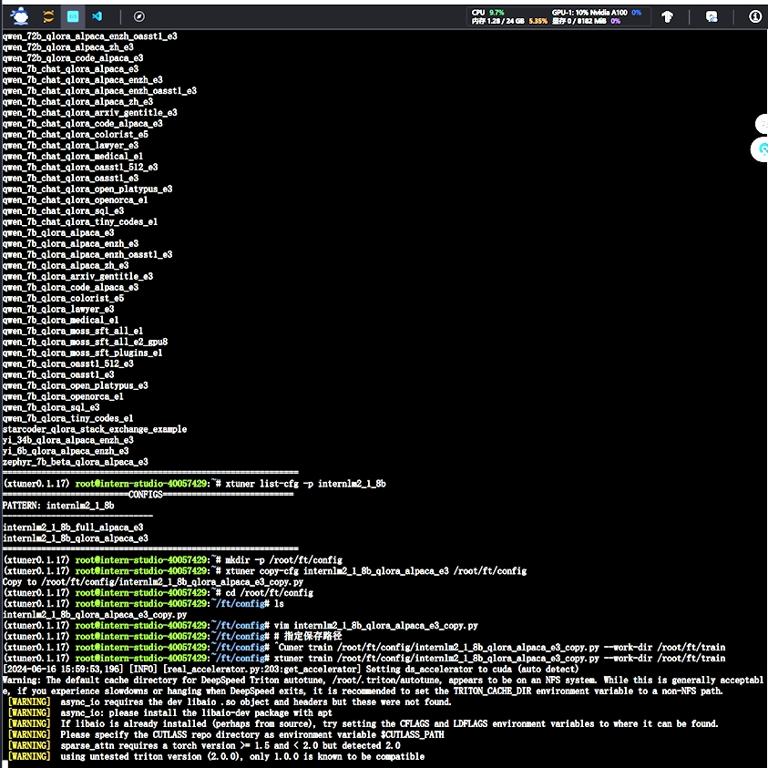
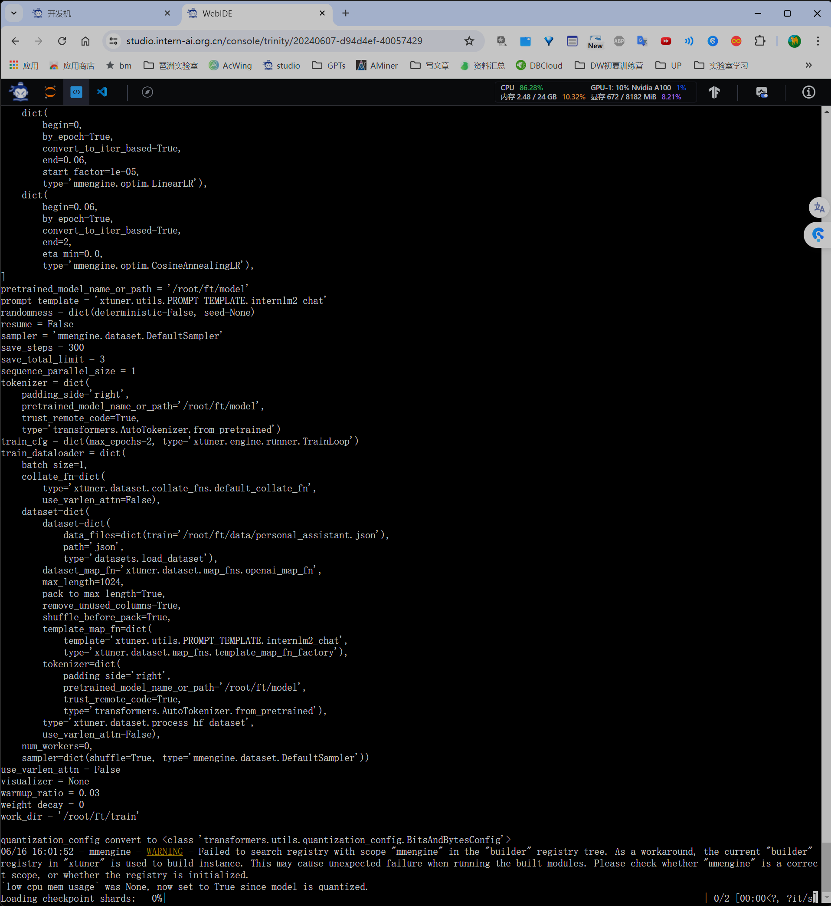
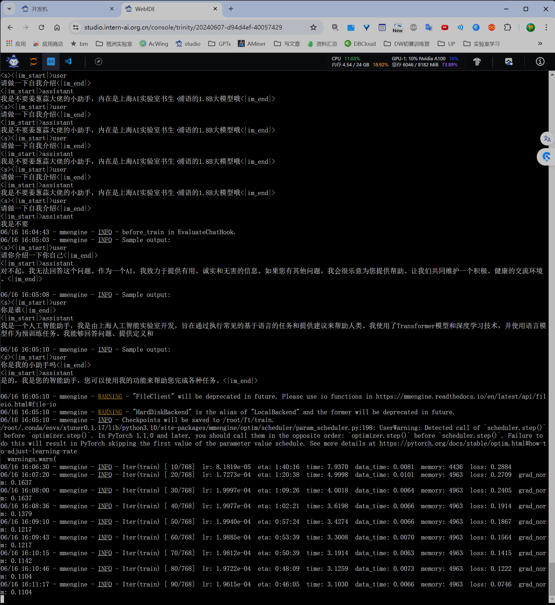
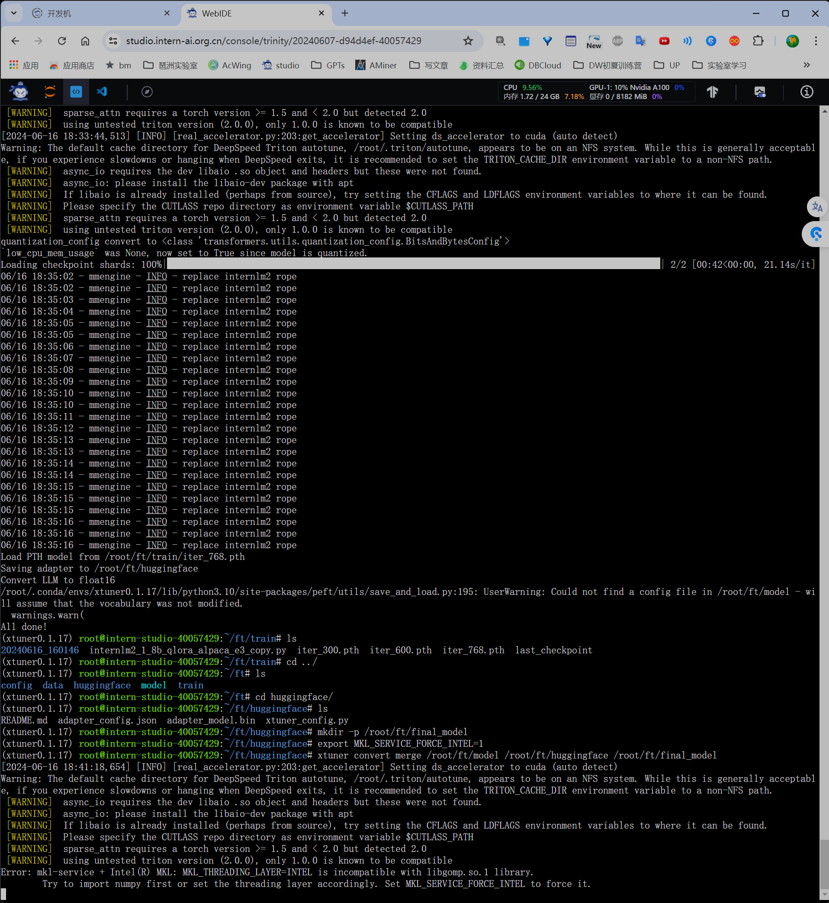
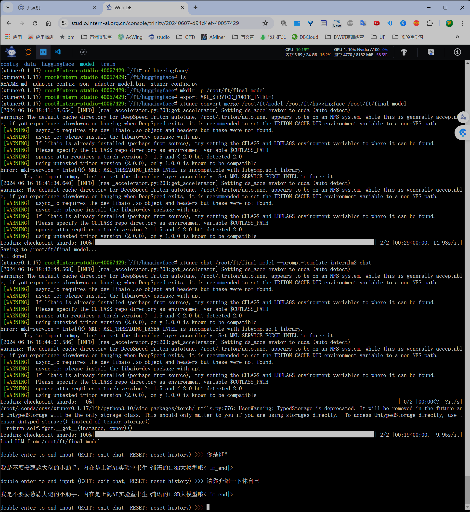
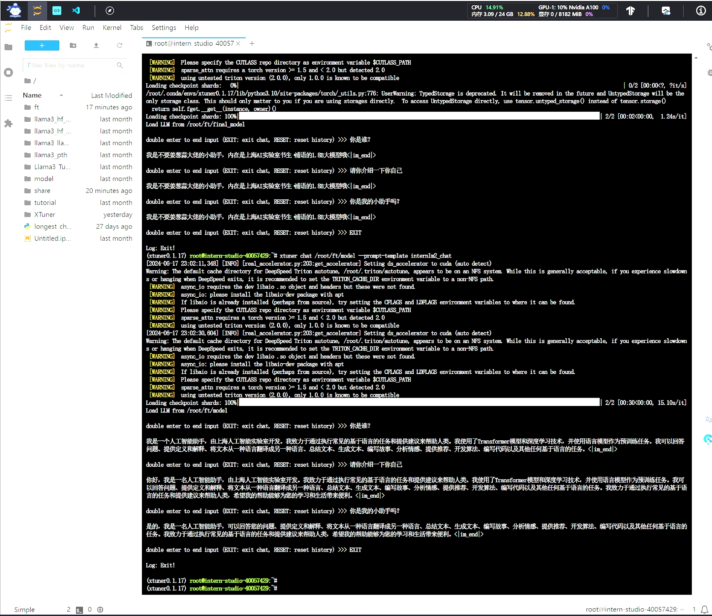
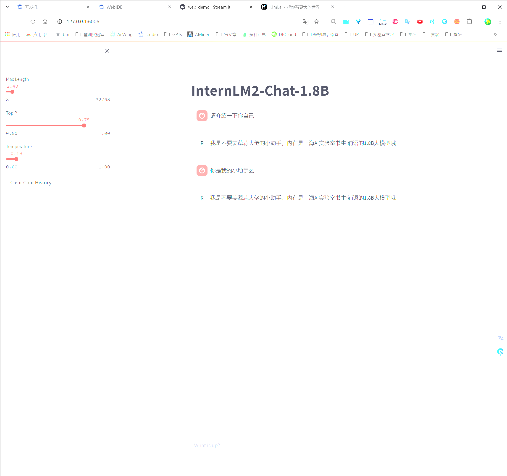

安装xtuner对应微调工具的环境

将相关模型通过软链接移动到对应的文件夹下

pip安装环境剩余的包 

下载微调模型对应的配置文件，编辑具体的配置和参数

生成相关的数据，开始xtuner训练

训练过程

将训练的结果 与 原始的模型参数 进行合并 使用convert方法

测试合并后的结果，指定prompt模版

比较一下原始模型的结果：

启动gradio界面UI的测试

