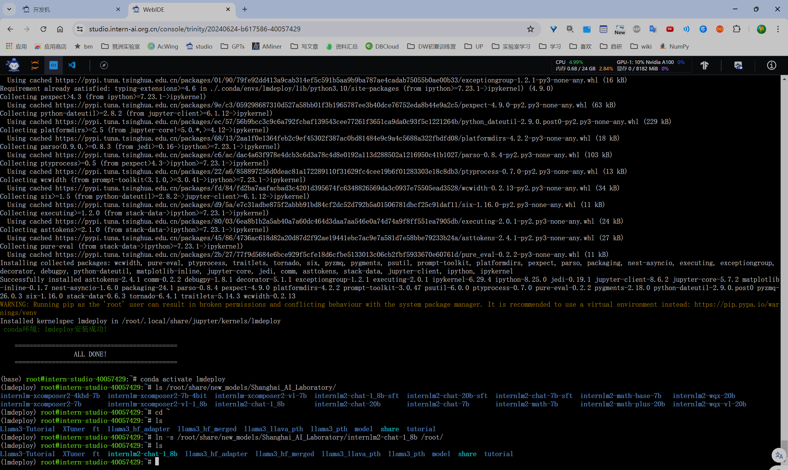

创建开发机及环境

安装conda环境

拷贝对应模型

激活环境安装缺失包

运行程序pipeline

测试pipeline

启动lmdeploy

lmdeploy对话

lmdeploy相关参数查看

传统内存使用,查看右上角

lmdeploy内存使用，查看右上角

lmdeploy限定内存使用，查看右上角

lmdeploy模型压缩

lmdeploy压缩细节

压缩前内存，查看右上角

压缩后内存，查看右上角

lmdeploy部署

[端口转发

在线生成的API

命令行测试部署server

浏览器端测试server服务

lmdeploy原始和压缩后

llava命令行测试

llava中文询问测试

gradio配置启动

gradio在线测试

lmdeploy速度提升展示

